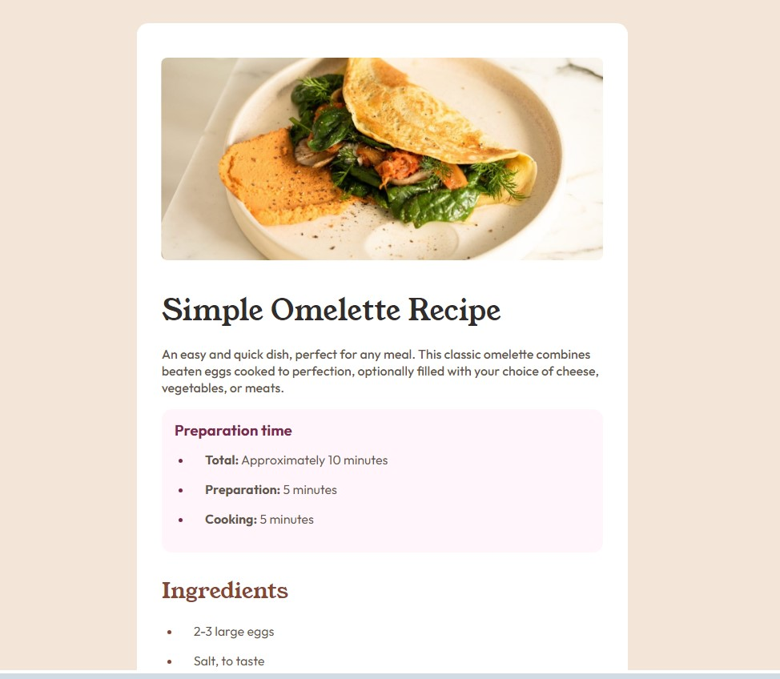

# Recipe Page: Semantic Layout & Typography Exercise

This project is a **historical practice** focused on mastering complex CSS layouts, web font integration, and semantic HTML5 structures. I preserve it in my portfolio as evidence of my ability to replicate high-fidelity professional designs with clean, organized code.

---

## 🚀 Demo
[SEE DEMO HERE](https://cmp2007.github.io/handy-recipe-page/)

### 🏆 Challenge Context
This project was developed as a solution to the [Recipe page challenge on Frontend Mentor](https://www.frontendmentor.io/challenges/recipe-page-KiTsR8QQKm).

### Screenshot

---

## 📋 Evolution & Context Note
> ⚠️ **Note on my trajectory:** This repository reflects my early mastery of CSS layout fundamentals. At the time of development, my focus was on pixel-perfect replication and the effective use of media queries to create a seamless transition between mobile and desktop views. It represents the foundation of my UI development skills before moving into dynamic components.

## 📋 Technical Milestones of this Stage
In this specific phase of my training, I successfully achieved:

* **Semantic Data Architecture:** Use of advanced HTML5 tags like `<article>`, `<table>`, and nested lists (`<ul>`/`<ol>`) to ensure content is structured logically and accessibly.
* **Complex CSS Typography:** Integration of multiple Google Fonts ('Young Serif' and 'Outfit') with precise control over line-height, font-weight, and hierarchical spacing.
* **Responsive Refinement:** Implementation of a mobile-first approach, using media queries to transform a full-width mobile view into a centered, card-style desktop layout with custom margins and border-radius.
* **Table Styling:** Mastering `border-collapse` and pseudo-classes like `:nth-child` to create clean, professional data visualizations for nutritional information.

## 🛠️ Technologies (at the time)
* **HTML5:** Advanced semantic structuring and data tables.
* **CSS3:** Media Queries, Flexbox, and Google Fonts API integration.
* **Normalize.css:** Implementation of CSS resets to ensure cross-browser consistency.

---
**Coded by [Carlos Miguel Puche](https://github.com/CMP2007)**
